# SDRoxide User Manual

SDRoxide is a PowerSDR/Thetis-style software-defined-radio transceiver. It gives
you a panadapter and waterfall, dual VFOs, a full set of receive and transmit
controls, FT8/FT4 digital modes with an integrated logbook, a wideband CW
skimmer, and the ability to drive either a SoapySDR device or a CAT-controlled
radio (such as a Xiegu, Icom, or Yaesu) with audio over a USB sound card. The
same interface runs as a native desktop application, streams to a web browser,
or connects to a remote sdroxide server.

---

## Table of contents

1. [Feature overview](#1-feature-overview)
2. [Basic operation](#2-basic-operation)
3. [Digital modes (FT8, FT4, PSK31, RTTY)](#3-digital-modes)
4. [Skimmers (CW, PSK, RTTY)](#4-skimmers)
5. [Radio and audio setup](#5-radio-and-audio-setup)
6. [Remote operation](#6-remote-operation)
7. [Web operation](#7-web-operation)
8. [Command-line reference](#8-command-line-reference)
9. [Configuration files](#9-configuration-files)
10. [Troubleshooting](#10-troubleshooting)
11. [Appendix: keyboard shortcuts, modes, bands](#11-appendix)

---

## 1. Feature overview

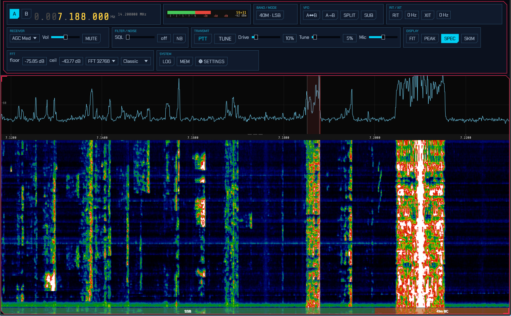

- **Panadapter and waterfall** with click/drag tuning, scroll-to-zoom, a
  draggable filter passband, a colour-coded band-plan strip, and eight
  selectable waterfall colour schemes (including an Icom-style palette).
- **Dual VFO (A/B)** with split operation, VFO swap/copy, and a sub-receiver on
  the inactive VFO.
- **All the common modes:** LSB, USB, CW, AM, SAM, NFM, WFM, DIGU, DIGL, DSB, a
  spectrum-only mode (SPEC), the automatic digital modes **FT8** and **FT4**, the
  keyboard modes **PSK31** and **RTTY**, and image **SSTV**.
- **Receive controls:** AGC (Off/Slow/Med/Fast), volume, mute, squelch, an
  impulse noise blanker, RIT, and a draggable filter passband.
- **Transmit** (on TX-capable rigs): PTT, TUNE, drive and tune-drive levels,
  mic gain, XIT, and a transmit meter (power / SWR / ALC). A ham-band-only
  transmit lockout is on by default.
- **FT8 / FT4** with a live decode list, automatic QSO sequencing, a world map,
  a transcript, and automatic logging.
- **Integrated logbook** for digital and manual QSOs, with ADIF and text export.
- **Wideband skimmers** — a CW skimmer plus PSK31 and RTTY skimmers that decode
  many signals at once and label them on the waterfall.
- **Four radio backends:** SoapySDR devices, OpenHPSDR (Hermes/Metis) Ethernet
  SDRs, a TCI server (ExpertSDR3/Thetis), or a CAT-controlled radio with audio
  over a USB sound card (demodulated audio or stereo IQ).
- **Memory channels** and per-band memory of your last frequency/mode/filter.
- **Remote and web operation:** run headless as a server and control it from a
  browser or from a second sdroxide instance over the network.

---

## 2. Basic operation

### 2.1 Launching

Start the native application with no arguments to use your configured radio:

```
sdroxide
```

To try the interface with no hardware, use the built-in signal generator:

```
sdroxide --siggen
```

See the [command-line reference](#8-command-line-reference) for all options.

### 2.2 The main window

The window has two parts: a **top control bar** of captioned modules that reflow
onto more rows as the window narrows, and the **panadapter** (spectrum plus
waterfall) filling the rest of the window. In FT8/FT4 the lower part of the
window is shared with the digital operating panel.

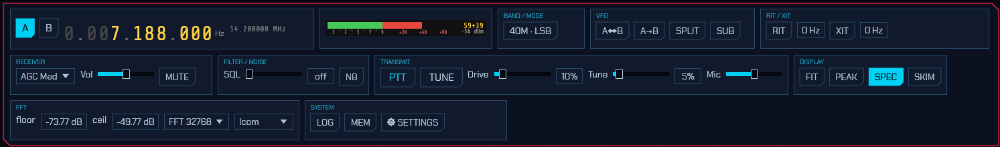

The control-bar modules, left to right, are: Frequency, S-meter, Band/Mode,
VFO, RIT/XIT, Receiver, Filter/Noise, Transmit (TX-capable rigs only), Display,
FFT, and System.

### 2.3 Tuning

**The frequency readout** is a ten-digit display. Hover over any digit and:

- **Scroll the mouse wheel** to tune that decade up or down.
- **Click the upper half** of a digit to increment it, the **lower half** to
  decrement it.

The smaller grey number below the readout is the *inactive* VFO's frequency.

**On the panadapter:**

- **Left-click** tunes the active VFO to the clicked frequency. **Shift+click**
  tunes VFO B instead.
- **Left-drag** grabs the spectrum and slides it (the tuning moves with the
  content).
- **Right-drag** pans the view only, without changing tuning.
- **Scroll the wheel** to zoom in and out around the cursor.
- Press **F** to reset the view to the full receiver span.

**Keyboard tuning** (ignored while typing in a text field):

- **Left / Right arrow:** ±100 Hz (with **Shift**, ±10 Hz).
- **Up / Down arrow:** ±1 kHz.
- **Page Up / Page Down:** ±10 kHz.

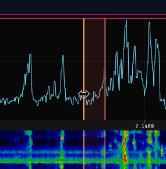

### 2.4 Bands and modes

Click the **Band / Mode** chip (which reads, for example, `20M · USB`) to open a
popup with three rows:

- **BAND:** `160M 80M 60M 40M 30M 20M 17M 15M 12M 10M 6M 2M GEN`. Each band
  remembers your last frequency, mode, and filter.
- **MODE:** `LSB USB CW AM SAM NFM WFM DIGU DIGL DSB SPEC`.
- **DIGITAL:** `FT8 FT4 PSK RTTY SSTV` (see [Digital modes](#3-digital-modes)).

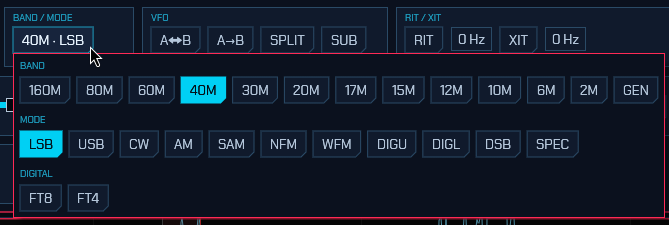

See the [appendix](#11-appendix) for what each mode is.

### 2.5 VFOs, split, and the sub-receiver

The **VFO** module has:

- **A / B** select chips in the Frequency module (the active VFO is highlighted).
- **Swap VFOs** — exchange A and B.
- **Copy A to B** — copy the active VFO to the other.
- **SPLIT** — transmit on one VFO and receive on the other.
- **SUB** — enable a second receiver on the inactive VFO (routed to the right
  ear). The inactive VFO's marker on the panadapter brightens when SUB is on.

### 2.6 RIT and XIT

The **RIT / XIT** module offsets receive (RIT) and, on TX-capable rigs, transmit
(XIT) without moving the dial. Toggle **RIT** (or **XIT**) on, then set the
offset in the adjacent field (±9999 Hz in 5 Hz steps).

### 2.7 Receiver controls

- **AGC** — a drop-down: `Off`, `Slow`, `Med`, `Fast`.
- **Vol** — audio volume.
- **MUTE** — mute the receiver (keyboard shortcut **M**).
- **SQL** (Filter/Noise module) — squelch; below the open threshold it reads
  `off`.
- **NB** — impulse noise blanker on the raw signal (keyboard shortcut **N**).

**The receive filter** is set by dragging the passband edges directly on the
panadapter: two vertical grip lines mark the filter's low and high edges (they
brighten to orange when you can grab them). Drag an edge to widen or narrow the
passband. The grips work on both the spectrum and the waterfall.

### 2.8 The display and FFT controls

**Display module:**

- **FIT** — auto-set the waterfall floor and ceiling for the best contrast.
- **PEAK** — show a decaying peak-hold trace over the spectrum.
- **SPEC** — show or hide the spectrum line above the waterfall (lit when the
  spectrum is shown).
- **SKIM** — the CW / PSK / RTTY skimmers (see [Skimmers](#4-skimmers)).

**FFT module:**

- **floor** / **ceil** — the waterfall's dB range.
- **FFT** size — `2048`, `4096`, `8192`, `16384`, or `32768`.

The **waterfall colour scheme** and the **spectrum background gradient** are set
on the **UI** tab of the Settings window (see
[radio and audio setup](#5-radio-and-audio-setup)). The colour scheme is one of
`Classic`, `Viridis`, `Gray`, `Icom`, `Neon`, `Synthwave`, `Matrix`, or `Tron`;
the gradient fills the spectrum area from a top colour down to a bottom colour
(default dark red → black) and can be turned off.

You can also resize the split between the spectrum line and the waterfall by
dragging the frequency-scale strip between them.

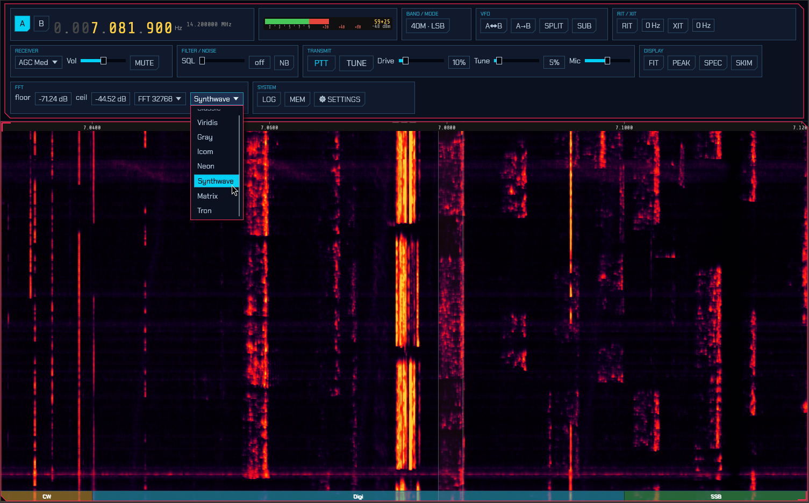

### 2.9 The S-meter

The **S-meter** reads S0 (−127 dBm) through S9 (−73 dBm) and beyond, with the
bar turning red past S9. It shows the S-unit (for example `S9+20`) and the level
in dBm. On transmit it is replaced by a transmit meter showing power, SWR, and
ALC as the rig reports them.

### 2.10 Transmit

On a TX-capable rig the **Transmit** module appears:

- **PTT** — key the transmitter.
- **TUNE** — send a carrier at the tune-drive level for tuning an ATU.
- **Drive** — transmit drive (0–100%).
- **Tune** — the (lower) drive level used by TUNE.
- **Mic** — microphone gain.

> **Transmit safety:** by default sdroxide refuses to transmit outside the
> amateur bands (`tx_ham_only`). Transmit hardware gains start at minimum and
> the tune drive defaults low. Raise drive deliberately.

### 2.11 Memory channels

Open **MEM** (System module) for the memory channels window. Type a name and
press **Store** to save the current frequency and mode. Each saved row has a
**RCL** (recall) button and a **DEL** (delete) button.

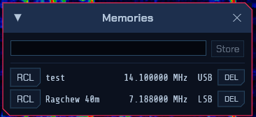

---

## 3. Digital modes

sdroxide has three families of digital mode. **FT8** and **FT4** are automatic,
timeslot-based modes with QSO sequencing, a world map, and automatic logging
(3.1–3.5). **PSK31** and **RTTY** are live keyboard modes: you tune onto a
signal, read the decoded text, and type a reply that transmits as you go (3.6).
**SSTV** is an image mode: received pictures build up in a gallery and you
transmit composed images (3.7).

### 3.1 Entering the mode

Open the Band/Mode popup and choose **FT8** or **FT4** from the DIGITAL row. The
panadapter locks to the digital sub-band (the audio range just above the dial),
and the FT8/FT4 operating panel appears in the lower part of the window. A
draggable divider sets how much height the panel gets.

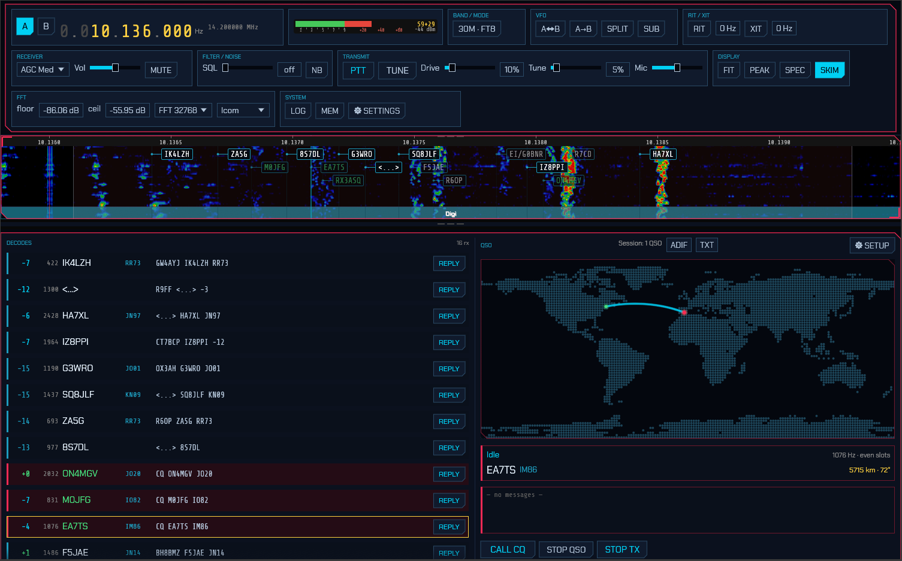

While in a digital mode a **FT8 FREQUENCIES** (or **FT4 FREQUENCIES**) row of
band chips appears in the Band/Mode popup. Click one to jump the dial to the
standard calling frequency for that band; a chip highlights when the dial is
already on it.

### 3.2 One-time setup: your callsign and grid

Click **SETUP** in the QSO area to open the **FT8 / FT4 Setup** window:

- **My callsign** — your call (entered in upper case).
- **My grid** — your Maidenhead grid locator (for example `FN42`).
- **TX period** — whether you call in the **Even** or **Odd** time slots.
- **Auto-sequence** — advance the QSO automatically (recommended on).
- **Message templates** — the CQ / Grid / Report / R+Report / RR73 / 73 lines,
  using the placeholders `{MYCALL}`, `{MYGRID}`, `{DX}`, and `{REPORT}`. The
  defaults follow standard FT8 practice; you rarely need to change them.

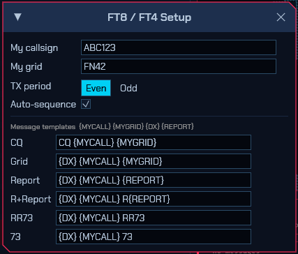

These settings are saved to `digi.json` (see [configuration files](#9-configuration-files)).

### 3.3 The operating panel

The panel has two halves:

- **DECODES** (left) — a live list of decoded stations. Each row shows the SNR
  (colour-coded by strength), the audio frequency, the callsign, the grid, and
  the full message, with a **REPLY** button on the right. CQ calls are
  highlighted. Decoded stations are also marked as boxes on the waterfall.
- **QSO** (right) — a world map (your location, the station you are working, and
  a transmit indicator), a station card showing the current step
  (`Idle`, `Calling CQ`, `Tx Grid`, `Tx Report`, `Tx R+Report`, `Tx RR73`,
  `Tx 73`, `Done`), and a transcript of the exchange (outgoing and incoming
  lines, plus the queued next message).

### 3.4 Working stations

- **Answer a call:** click **REPLY** on a decode. sdroxide adopts that station,
  picks the opposite time slot, and runs the exchange automatically.
- **Call CQ:** click **CALL CQ**. The first station that answers becomes your
  QSO.
- **Set your transmit tone:** click a decode row (or click a station box on the
  waterfall) to set your transmit audio frequency to that station's frequency.
  The audio frequency is clamped to 200–3500 Hz.
- **Stop:** **STOP QSO** ends the current QSO gracefully; **STOP TX** aborts the
  current transmission immediately and un-keys.

Transmission happens automatically in your chosen time slot (FT8 slots are 15 s,
FT4 slots are 7.5 s) and goes through the normal transmit path, so the ham-band
lockout and transmit safety still apply.

### 3.5 Logging and the logbook

Completed FT8/FT4 QSOs are logged automatically. Open the full logbook with the
**LOG** button (System module).

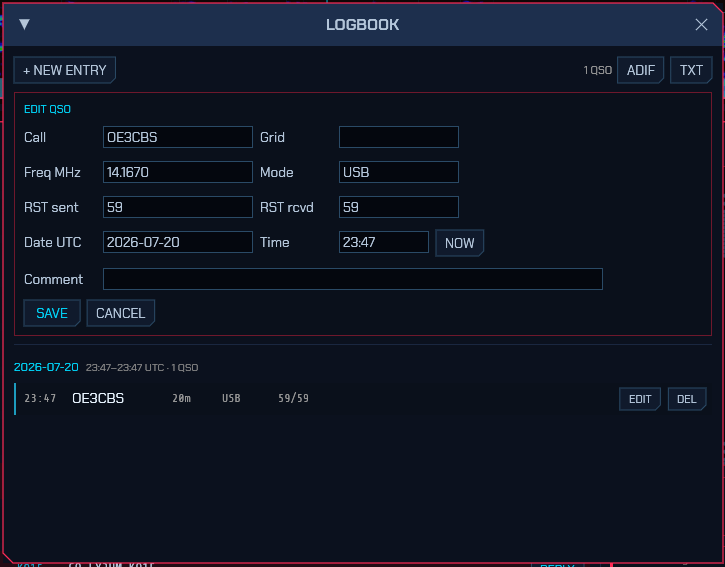

The logbook lists QSOs grouped by day (newest first) and covers both digital and
manual entries. You can:

- **+ NEW ENTRY** — add a manual QSO (Call, Grid, Freq MHz, Mode, RST sent, RST
  received, Date/Time UTC with a **NOW** button, and a comment).
- **EDIT** / **DEL** — edit or delete an entry.
- **ADIF** — export the whole log to `sdroxide-log.adi`.
- **TXT** — export the whole log to `sdroxide-log.txt`.

The log is stored in `qso_log.json`.

### 3.6 PSK31 and RTTY

Choose **PSK** or **RTTY** from the DIGITAL row of the Band/Mode popup. As with
FT8/FT4 the panadapter switches to a zoomed sub-band waterfall, but the lower
panel is a live **messaging area** instead of a QSO sequencer.


**Receiving:**

- Decoded text streams into the receive window as signals are copied.
- Tune exactly onto a signal with the **−/+** buttons (±10 Hz) — or click its
  skimmer label (see [Skimmers](#4-skimmers)). In RTTY, two amber
  lines on the waterfall mark the expected mark/space tones to tune between.

**Transmitting (type-ahead):**

- Type your reply in the transmit box and press **TX** to key up. Text is sent as
  you type; characters that have already gone out turn **green**, so you can
  watch the transmission catch up when you pause.
- **CALL CQ** loads a CQ macro and starts sending it; **CLEAR** empties the
  buffer and stops; pressing **TX** again unkeys.

**Settings (PSK/RTTY setup dialog):**

- **PSK** is BPSK31 — differential BPSK with the standard varicode alphabet.
- **RTTY** defaults to 45.45 baud, 170 Hz shift, Baudot (ITA2). **Shift**
  (170 / 425 / 850 Hz) and **Baud** (45 / 50 / 75) are selectable.
- Your callsign and grid (shared with the FT8/FT4 setup) fill the CQ macro.

**Skimmers:** the PSK and RTTY skimmers (see [Skimmers](#4-skimmers)) label
signals across each band's PSK/RTTY calling sub-bands. Clicking a label from any
mode switches to PSK or RTTY, tunes onto the signal, and opens this panel.

### 3.7 SSTV

Choose **SSTV** from the DIGITAL row to send and receive pictures. The panel has
a received-image gallery on the left and a transmit compositor on the right, with
a row of mode buttons across the top: **Auto**, **Scottie 1**, **Scottie 2**,
**Scottie DX**, **Martin 1**, **Martin 2**, **Robot 72**, and **Robot 36**.

**Auto** (the default) auto-detects the mode on receive — from the VIS header, or,
if you tune in mid-picture, from the sync cadence — and transmits in **Martin 1**
until a mode has been detected. Selecting a specific mode instead pins both the
receive decoder and the transmit compositor to that mode.

Band buttons tune to that band's common SSTV calling frequency (for example
14.230 MHz on 20 m, 7.171 on 40 m, 3.730 on 80 m), staying in SSTV.

**Receiving:**

- Incoming pictures decode scanline-by-scanline and appear in the **LIVE** view
  as they arrive, then land in the **RECEIVED** gallery (newest first).
- The **Signal** meter shows the receive audio level so you can confirm audio is
  reaching the decoder and set your input gain.
- In **Auto**, the mode is identified from the VIS header (or the sync cadence if
  you tuned in mid-picture) and pre-selected for your next transmission — no need
  to pick it.
- Received images are saved as PNG under `~/.config/sdroxide/sstv_rx/` and reload
  into the gallery next time.

**Transmitting:**

- The **TRANSMIT** side has five image slots. **Click** a slot to select it;
  **double-click** a slot (or click an empty one) to pick an image file, which is
  automatically cropped and scaled to the current mode's dimensions and stored
  under `~/.config/sdroxide/sstv_tx/`.
- Type a **message** below the slots. Each line is drawn over the image in a
  different font, bold with a black outline for readability. A **live preview**
  shows exactly what will be transmitted, including a small red→black header
  strip with your **callsign** on the left and "SDRoxide" + version on the right.
  (Set your callsign on the **General** settings tab, or the FT8 setup dialog.)
- Press **TX** to transmit the composed image; **ABORT TX** stops a transmission
  in progress.
- **TX slant** trims the transmit clock (in ppm) to remove slant seen on a
  receiver whose sound-card clock differs slightly from yours — nudge it until a
  test picture decodes straight on the far end; **0** resets it. It applies to
  the next transmission and is persisted. (Received pictures are auto-deslanted
  by sdroxide, so this is only for the transmit direction.)

> **Note:** SSTV decode/encode runs in the server engine, so the panel works the
> same in the native app and the browser client. RX quality depends on signal
> conditions — clean signals decode well; weak or drifting signals may slant or
> show noise (ongoing refinement).

---

## 4. Skimmers

The skimmers decode many signals at once across a wide (~192 kHz) window and
label each one on the waterfall. There are three: **CW**, **PSK31**, and
**RTTY**.

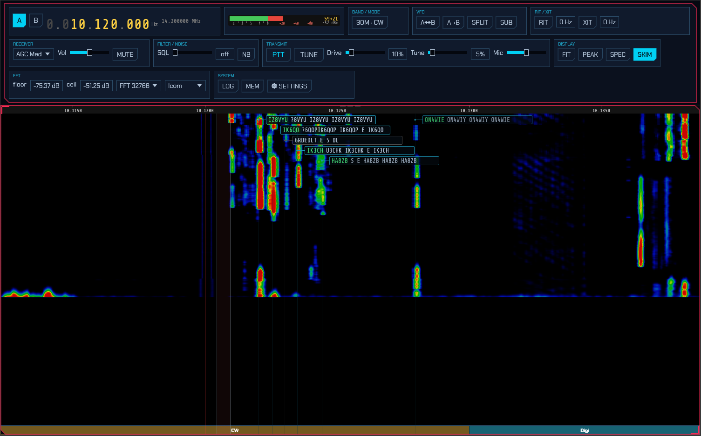

- Toggle them with the **SKIM** button in the Display module. On a SoapySDR (IQ)
  source the skimmer is **on by default**.
- Each decoded signal appears as a box next to its trace on the waterfall,
  showing the callsign (once resolved, for CW) and a rolling tail of decoded
  text. Boxes fade out a few seconds after a signal stops.
- **Click a skimmer box** to tune to that signal and switch to its mode — CW for
  a CW spot, PSK or RTTY for a digimode spot (which also opens the messaging
  panel, [3.6](#36-psk31-and-rtty)).

**Band-aware gating.** To avoid noise and false decodes, each skimmer only runs
where its mode is used: the CW skimmer in CW sub-bands, and the PSK and RTTY
skimmers in each band's PSK/RTTY calling sub-bands — with the FT8, FT4, and WSPR
watering-holes excluded so their signals aren't mistaken for PSK or RTTY. The
skimmer-decoded text is a coarse best-effort copy; switch to the mode (click a
box) for a clean decode.

> **Note:** the skimmers are a wideband feature and work only with true IQ/SDR
> sources (SoapySDR, HPSDR, TCI). They are unavailable when a CAT radio is
> feeding demodulated audio (see [radio and audio setup](#5-radio-and-audio-setup)),
> because that mode has only a narrow audio slice rather than a wide IQ span.

---

## 5. Radio and audio setup

Open the **SETTINGS** button (System module). The Settings window has four
tabs: **General**, **Radio**, **Audio**, and **UI**. The **General** tab holds
your **callsign** and **grid square** — the same values used by FT8/FT4, the SSTV
image header, and the logbook (and also editable from the FT8/SSTV setup dialog).

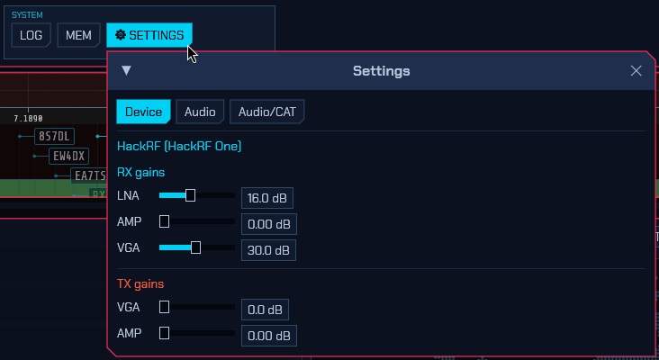

### 5.1 Choosing a backend

On the **Radio** tab, **Radio interface** selects how sdroxide talks to your
radio:

- **SoapySDR** — a SoapySDR device (wideband IQ). The default. See
  [5.2](#52-soapysdr-devices).
- **HPSDR (network)** — an OpenHPSDR (Hermes/Metis) Ethernet SDR on the LAN. See
  [5.4](#54-openhpsdr-network-radios).
- **CAT / Audio** — a CAT-controlled radio with audio over a USB sound card. See
  [5.3](#53-cat-radios-serial-control--usb-audio).
- **TCI (network)** — a TCI server such as ExpertSDR3 or Thetis. See
  [5.5](#55-tci-expertsdr3--thetis).

The controls shown below the selector change to match the chosen interface.

> Radio-interface, serial, sound-format, and radio-audio-device changes take
> effect on the next start. Restart sdroxide after changing them.

### 5.2 SoapySDR devices

With the **SoapySDR** interface, the **Radio** tab shows the controls the device
exposes:

- **RX gains** — one slider per gain element (dB, with the device's own limits).
- **TX gains** — transmit gain sliders, if the device has them.
- **Antenna** — a drop-down when the device has more than one RX antenna.

The device to open and the sample rate come from `config.toml`
(`device_args`, `sample_rate`). For example, `device_args = "driver=hackrf"`;
an empty value uses the first device found. You can also override the device on
the command line with `--device`.

### 5.3 CAT radios (serial control + USB audio)

A CAT radio is configured on the **Radio** tab (with the sound card chosen on
the **Audio** tab, [5.6](#56-radio-audio-devices)). The audio arrives over a USB
sound card, separately from your computer's speakers and microphone.

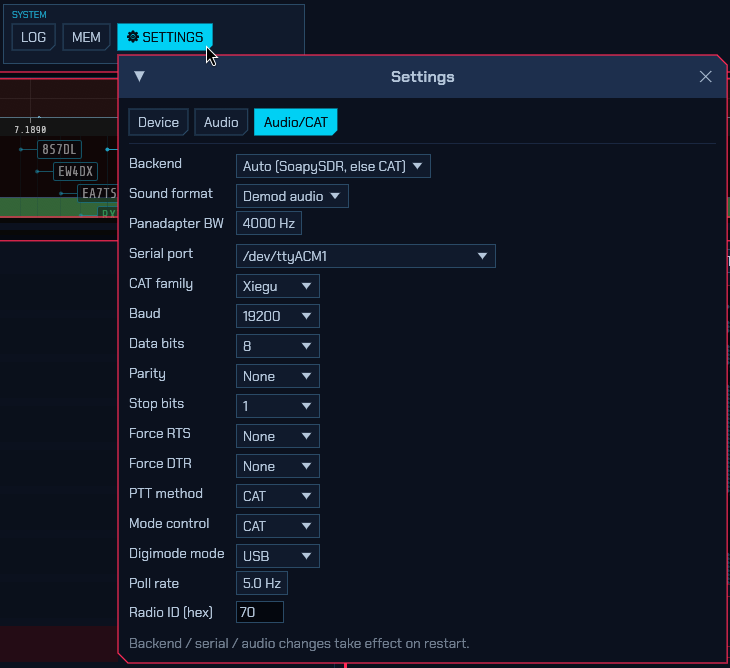

**Sound format** — how the radio's audio is interpreted:

- **Demod audio** — the radio sends already-demodulated (mono) audio. The
  panadapter shows a narrow slice of the audio band mapped to RF, whose width is
  set by **Panadapter BW**. This is the common case for rigs like the Xiegu
  X6100.
- **IQ (stereo)** — the radio sends a stereo IQ signal (I on the left channel, Q
  on the right). This gives a full panadapter but requires a **stereo** capture
  device (see the note below).

**Serial (CAT) settings:**

- **Serial port** — the radio's CAT serial port. On Linux, USB-style ports
  (`/dev/ttyACM*`, `/dev/ttyUSB*`) are listed first.
- **CAT family** — `Xiegu`, `Icom`, or `Yaesu`.
- **Baud**, **Data bits**, **Parity**, **Stop bits** — the serial line settings
  (for example 19200 8N1 for a Xiegu X6100).
- **Force RTS** / **Force DTR** — hold a control line high or low (some
  interfaces need this).
- **PTT method** — `CAT`, `DTR`, `RTS`, or `VOX` (how transmit is keyed).
- **Mode control** — `CAT` (sdroxide sets the radio's mode to match) or
  `Radio controlled` (you set the mode on the radio and sdroxide follows).
- **Digimode mode** — what to switch the rig to for FT8/FT4: `USB`, `DIGI`, or
  `Radio controlled`.
- **Poll rate** — how often (Hz) sdroxide reads the rig's frequency and mode.
- **Radio ID (hex)** — the CI-V address, for Icom and Xiegu radios.

### 5.4 OpenHPSDR (network radios)

With the **HPSDR (network)** interface, sdroxide reaches an OpenHPSDR
(Hermes/Metis-family) Ethernet SDR over the LAN — no sound card or serial port
involved. On the **Radio** tab:

- **Discover** — scan the local network for HPSDR devices and pick one from the
  list. Protocol 2 devices are selectable; Protocol 1-only devices (such as the
  Hermes Lite 2) are listed greyed-out.
- **Manual IP** — connect directly to a known address (for example
  `192.168.1.50`), skipping discovery.
- **Sample rate** — the DDC receive rate: 48, 96, 192, 384, 768, or 1536 kHz.
  Wider rates give a wider panadapter span at more CPU/network cost.

Receive is wideband IQ, so the full panadapter and the skimmers work.

### 5.5 TCI (ExpertSDR3 / Thetis)

With the **TCI (network)** interface, sdroxide connects to a TCI server — such as
Expert Electronics **ExpertSDR3** or **Thetis** — over a WebSocket, receiving a
wideband IQ stream and transmitting audio back. On the **Radio** tab:

- **Server address** — the TCI `host:port`. The default `127.0.0.1:50001` is
  ExpertSDR3's TCI listener on the same machine; enable *TCI* in the SDR software
  first.
- **IQ sample rate** — the receive IQ stream rate: 48, 96, or 192 kHz.
- **Test connection** — verify sdroxide can reach the server and report what it
  found, without leaving the dialog.

Receive is wideband IQ (full panadapter and skimmers); transmit sends audio to
the TCI server, which modulates it.

### 5.6 Radio audio devices

On the **Audio** tab, the *Radio audio* section selects the sound card the CAT
radio uses:

- **From radio (RX)** — the capture device carrying the radio's receive audio.
- **To radio (TX)** — the playback device carrying your transmit audio to the
  radio.

Device names include the manufacturer, model, ALSA card id, and USB id — for
example `C-Media Electronics Inc. USB Audio Device, USB Audio [Device · 0d8c:0012]`
— so two identical adapters can be told apart.

> **IQ needs a stereo device.** IQ format requires a two-channel capture
> interface (I and Q). A mono USB audio adapter cannot carry IQ; if you pick one
> for IQ, sdroxide refuses it and shows a warning banner. Use a stereo line-input
> interface for IQ, or choose **Demod audio**.

### 5.7 Your own audio devices

The *Your audio* section of the **Audio** tab selects the speakers and
microphone sdroxide uses for you (separate from the radio-audio devices):

- **Output** — where receive audio is played.
- **Input** — your microphone for voice transmit.

Each defaults to **System default**. These can be changed live. The equivalents
in `config.toml` are `audio_output` and `audio_input`.

### 5.8 Linux / PipeWire note for dedicated radio sound cards

On a PipeWire system, the desktop audio server can hold a USB radio codec's
capture device open, which intermittently blocks sdroxide from opening it (the
symptom is silent receive and a "waiting for spectrum" panadapter). For a
sound card dedicated to the radio, the reliable fix is to tell WirePlumber to
stop managing that card, leaving it for sdroxide. Create a drop-in such as
`~/.config/wireplumber/wireplumber.conf.d/51-radio.conf` that disables the
card, then restart WirePlumber. See [troubleshooting](#10-troubleshooting).

### 5.9 UI preferences

The **UI** tab holds display preferences (stored in `config.toml` under `[ui]`):

- **Screen update rate** — the GUI/spectrum frame rate (30, 60, or 90 fps).
- **Waterfall scroll speed** and **Spectrum update speed** — how fast the
  waterfall scrolls and how quickly the spectrum line reacts (slower = more
  averaged/smoother).
- **Waterfall palette** — the waterfall colour scheme (see [2.8](#28-the-display-and-fft-controls)).
- **Spectrum background** — a vertical gradient behind the spectrum line, with a
  top and bottom colour (default dark red → black); untick **Gradient** for a
  plain background.

---

## 6. Remote operation

sdroxide can run as a headless server and be controlled from a second sdroxide
instance (a native remote client) elsewhere on the network.

### 6.1 Start the server

```
sdroxide --server --port 4950
```

The server opens the configured radio, streams spectrum and audio, and accepts a
WebSocket control connection. The default port is **4950** and the default bind
address is **all interfaces** (`0.0.0.0`).

### 6.2 Connect a native remote client

On another machine:

```
sdroxide --connect HOST:4950
```

`--connect` accepts `host`, `host:port`, or a full `ws://…` URL. The remote
client is the full sdroxide GUI running against the server: control, state,
memories, meters, spectrum, FT8 decodes and logging, and skimmer spots all work.
Receive audio streams down (48 kHz mono), and your microphone is sent up to the
server while you transmit. The remote client uses your local speakers and
microphone for audio.

### 6.3 What to know

- **One client at a time.** A second connection is refused with a "server busy"
  message.
- **No authentication or encryption.** The server has no password and no TLS, and
  it binds to all interfaces by default, so anyone who can reach the port has
  full control of the radio, *including transmit*. Only expose it on a trusted
  network, or put it behind a VPN or an HTTPS reverse proxy that adds
  authentication.

---

## 7. Web operation

The same server serves a browser client, so you can operate from any device with
a web browser.

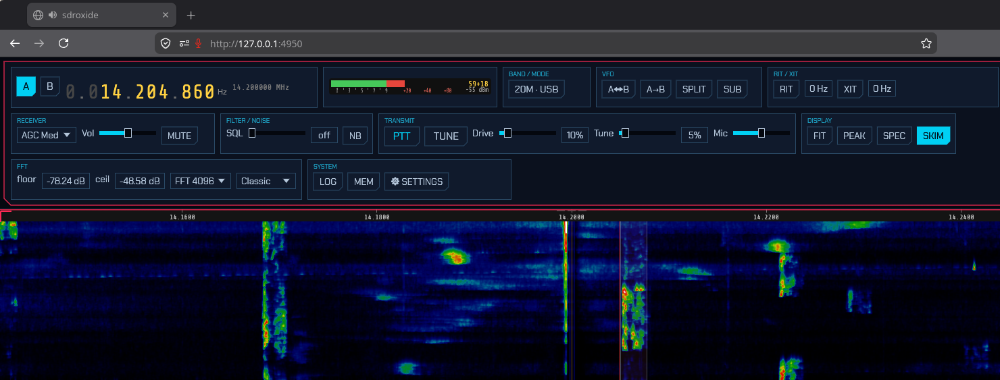

### 7.1 Serve the web client

Builds that bundle the web UI (compiled with the `embed-web` feature, including
the packaged binaries) serve it automatically:

```
sdroxide --server
```

Then open a browser at:

```
http://HOST:4950/
```

The page connects back to the server over a WebSocket at `/ws` automatically.

If you are running a build without the embedded web UI, point the server at a
trunk-built web directory:

```
sdroxide --server --web-root path/to/sdroxide-web/dist
```

### 7.2 What works in the browser

The web client mirrors the native UI: tuning, mode and band changes, the
panadapter and waterfall, receive audio, FT8/FT4, the logbook, memories, and
meters. Microphone transmit is supported where the browser grants microphone
access. The same single-client and no-authentication notes as
[remote operation](#6-remote-operation) apply — put the server behind HTTPS with
authentication if it is reachable from an untrusted network.

---

## 8. Command-line reference

| Option | Description |
| --- | --- |
| `--device <ARGS>` | SoapySDR device args, e.g. `driver=hackrf` (default: config, then first device). |
| `--probe` | List devices and their probed capabilities, then exit. |
| `--console` | Terminal (text) waterfall instead of the GUI. |
| `--siggen` | Use the built-in signal generator instead of hardware. |
| `--file <PATH>` | Play a raw interleaved CF32 IQ file instead of hardware. |
| `--freq <HZ>` | Center frequency in Hz (default 14,200,000). |
| `--rate <HZ>` | Sample rate in Hz (default: from config). |
| `--gain <DB>` | Overall RX gain in dB (default: hardware AGC or a moderate value). |
| `--mode <MODE>` | Initial mode (USB, LSB, CW, AM, SAM, NFM, WFM, DIGU, DIGL, DSB, SPEC, FT8, FT4, PSK, RTTY, SSTV). |
| `--server` | Run as a server (web client + WebSocket streaming backend). |
| `--connect <HOST[:PORT]>` | Connect as a native remote client to a running server. |
| `--port <PORT>` | Server port (default: from config, 4950). |
| `--web-root <DIR>` | Directory with the built web client (default: embedded assets). |
| `--fft <SIZE>` | Spectrum FFT size (default 4096). |
| `--fps <N>` | Console waterfall lines per second (default 15). |
| `--db-floor <DBFS>` | Display floor in dBFS (default −110). |
| `--db-ceil <DBFS>` | Display ceiling in dBFS (default −10). |
| `--width <CHARS>` | Console spectrum width in characters (default 100). |

**Testing without a radio:** `--siggen` (built-in signal generator), `--file`
(replay an IQ recording), `--probe` (list SoapySDR devices), and `--console`
(a text-mode waterfall) are handy for trying things out.

---

## 9. Configuration files

sdroxide stores its settings under the per-user config directory:

| Platform | Location |
| --- | --- |
| Linux | `~/.config/sdroxide/` |
| macOS | `~/Library/Application Support/org.sdroxide.sdroxide/` |
| Windows | `%APPDATA%\sdroxide\sdroxide\config\` |

| File | Format | Contents |
| --- | --- | --- |
| `config.toml` | TOML | General settings: `device_args`, `sample_rate`, `cal_offset_db`, `spectrum_fft`, `spectrum_fps`, `server_bind`, `server_port`, `tx_ham_only`, `audio_output`, `audio_input`. |
| `radio.json` | JSON | Radio backend: SoapySDR vs CAT, serial/CAT settings, sound format, and the radio's sound-card device names. |
| `digi.json` | JSON | FT8/FT4 operator settings: your callsign and grid, TX period, auto-sequence, and message templates. |
| `memories.json` | JSON | Saved memory channels. |
| `bandstacks.json` | JSON | Per-band memory of your last frequency/mode/filter (up to three per band). |
| `qso_log.json` | JSON | The logbook (digital and manual QSOs). |

Every file has sensible defaults, so a missing or partial file always loads. You
normally edit these through the GUI rather than by hand.

---

## 10. Troubleshooting

**"Waiting for spectrum" and no receive audio (CAT radio).**
The radio's capture device could not be opened. Common causes:

- The device is being held by the system audio server (PipeWire/PulseAudio). On
  Linux, for a dedicated radio sound card, disable that card in WirePlumber so
  sdroxide can open it exclusively:

  ```
  # ~/.config/wireplumber/wireplumber.conf.d/51-radio.conf
  monitor.alsa.rules = [
    {
      matches = [ { device.name = "alsa_card.usb-<your-card>" } ]
      actions = { update-props = { device.disabled = true } }
    }
  ]
  ```

  Then run `systemctl --user restart wireplumber`. (Find the exact
  `device.name` with `wpctl status` or `pw-dump`.)
- The device is in use by another program, or was unplugged. sdroxide shows a
  warning banner naming the device; use **Dismiss** to hide it after fixing the
  device.

**IQ shows no spectrum, or a warning that the device is mono.**
IQ requires a two-channel (stereo) capture device. A mono USB adapter cannot
carry I and Q. Use a stereo line-input interface for IQ, or switch **Sound
format** to **Demod audio**.

**The CAT radio does not change mode.**
On the **Audio/CAT** tab, set **Mode control** to **CAT**. For FT8/FT4, set
**Digimode mode** to **USB** or **DIGI** as your rig expects. Check the serial
port, baud, and (for Icom/Xiegu) the **Radio ID**.

**Two identical USB sound cards are hard to tell apart.**
Device names include the manufacturer, model, ALSA card id, and USB id in
brackets (e.g. `… [Device_1 · 0d8c:0014]`), which disambiguates identical
adapters. Re-select the intended device in the **Audio** tab if the names
changed after an update.

**A setting did not take effect.**
Backend, serial, sound-format, and radio-audio-device changes apply on restart.
Restart sdroxide.

---

## 11. Appendix

### Keyboard shortcuts

| Key | Action |
| --- | --- |
| Left / Right arrow | Tune ±100 Hz (with Shift, ±10 Hz). |
| Up / Down arrow | Tune ±1 kHz. |
| Page Up / Page Down | Tune ±10 kHz. |
| M | Toggle mute. |
| N | Toggle noise blanker. |
| F | Fit the view to the full receiver span. |

Shortcuts are ignored while typing in a text field.

### Modes

| Mode | Description |
| --- | --- |
| LSB / USB | Lower / upper sideband voice. |
| CW | Morse (continuous wave). |
| AM | Amplitude modulation. |
| SAM | Synchronous AM. |
| NFM / WFM | Narrow / wide FM. |
| DIGU / DIGL | Data over USB / LSB (general digital). |
| DSB | Double sideband. |
| SPEC | Spectrum only (no demodulation). |
| FT8 / FT4 | Automatic digital modes with decoding, QSO sequencing, and logging. |
| PSK | PSK31 keyboard mode (BPSK31 / varicode). |
| RTTY | RTTY keyboard mode (Baudot; selectable shift and baud). |
| SSTV | Slow-scan TV image mode (Scottie, Martin, Robot). |

### Bands

`160M`, `80M`, `60M`, `40M`, `30M`, `20M`, `17M`, `15M`, `12M`, `10M`, `6M`,
`2M`, and `GEN` (general coverage). Bands your device cannot receive are
disabled in the selector.

### Waterfall colour schemes

`Classic` (PowerSDR-style), `Viridis`, `Gray`, `Icom` (Icom-style palette,
peaking at red with no white blow-out), `Neon`, `Synthwave`, `Matrix`, and
`Tron`. Chosen on the **UI** tab of the Settings window ([5.9](#59-ui-preferences)).
